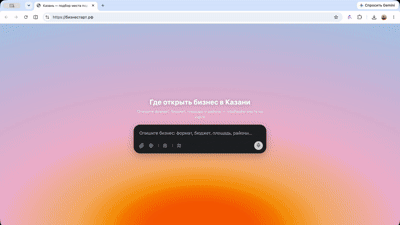
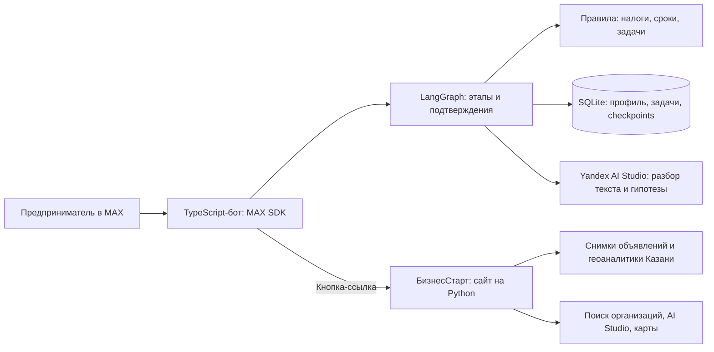

# БизнесСтарт — навигатор предпринимателя в MAX

Помогаем начинающему предпринимателю перейти от идеи к открытию ООО и понять, что делать дальше. Чат-бот сохраняет сведения о бизнесе, ведёт по этапам регистрации, показывает задачи и сравнивает налоговые сценарии. Геоаналитический сайт помогает выбрать помещение для бизнеса в Казани.



Приоритетный пользователь MVP — человек, который впервые открывает небольшое ООО и пока не имеет собственной команды бухгалтеров и юристов. Результат: сохранённый профиль, понятное следующее действие, персональный список задач и предварительное сравнение вариантов. Бот не подаёт документы и не открывает банковский счёт за пользователя.

## 1. Доступ и версия решения

| Объект | Доступ / состояние |
| --- | --- |
| MAX-бот | В существующей документации указан **«Хакатон МАХ 610», `@t610_hakaton_max_bot`**. Откройте личный диалог и отправьте `/start`. Актуальность имени и публичный доступ нужно подтвердить перед сдачей. |
| Сайт | [БизнесСтарт](https://бизнестарт.рф/). В боте: `/menu` → «Подобрать помещение» → «Перейти на БизнесСтарт». Доступность размещённой версии при подготовке документации не проверялась. |
| Исходный код | [GitHub: effective_business_bot](https://github.com/ShvetsovEgor/effective_business_bot) |
| База документации | `b0a45b9858547354069580d2837edbf5ec255bca` — объединённая версия кода до оформления документации. Это **не окончательный хеш сдачи**. |
| Фиксация релиза | После коммита документации получить `git rev-parse HEAD`, передать хеш вместе с репозиторием и не менять сдаваемую версию после дедлайна. См. [чек-лист сдачи](docs/SUBMISSION.md). |

Контейнеризация не заменяет работающий бот в MAX. На время проверки должен быть запущен один экземпляр бота и доступен сайт.

## 2. Основной пользовательский сценарий

1. Открыть бот, отправить `/start`, описать идею бизнеса и подтвердить её.
2. Посмотреть предварительный анализ, выбрать ООО и заполнить финансовые параметры. Извлечённые моделью сведения подтверждаются пользователем.
3. Сравнить налоговые варианты с формулами и ограничениями, выбрать режим, проверить итоговый план.
4. Пройти регистрацию по коротким шагам с пояснениями, документами и официальными источниками. Подачу документов пользователь выполняет самостоятельно.
5. Заполнить профиль зарегистрированного ООО и получить задачи. Счёт, капитал, бухгалтерия и другие действия доступны параллельно.
6. Отмечать задачи выполненными: они исчезают из активного списка и сохраняются в архиве. После перезапуска профиль и прогресс восстанавливаются.

На любом этапе можно задать конкретный вопрос и вернуться к текущему шагу. Документы и задачи доступны через «Мой профиль». Для существующего ООО есть сокращённый вход из главного меню. Подбор помещения открывает отдельный сайт; сведения между ним и профилем бота автоматически не синхронизируются.

[Сценарий проверки с тестовыми данными и ожидаемыми результатами](docs/DEMO.md).

## 3. Состав и архитектура



| Компонент | Назначение | Реализация |
| --- | --- | --- |
| Бот | Диалог, inline-кнопки, отправка документов | `src/bot`, официальный `@maxhub/max-bot-api`, Long Polling |
| Маршрут и память | Подтверждения, восстановление этапа, профиль | `src/graph`, `src/services`, SQLite checkpointer |
| Бизнес-правила | Расчёты и применимость задач независимо от LLM | `src/domain`, `src/data` |
| AI-адаптер | Разбор текста и предварительный анализ идеи | `src/ai`, Yandex Responses API через OpenAI SDK |
| Геоаналитика | Карта, подбор и сравнение помещений | `yandex_map`, `analysis`, `llm`, `neurosearch` |
| Хранение | Бизнес-БД и checkpoints; файловые снимки сайта | SQLite и JSON/CSV, отдельный сервер БД не нужен |

Подробности: [техническая документация бота](README.bot.md), [документация сайта](README.geo.md). `bot.py` — старый диагностический бот, в основной сценарий и основной запуск не входит.

## 4. Окружение и одна команда запуска всех компонентов

Нужны Git, Docker Engine / Docker Desktop с Compose v2, свободный порт **80**, интернет и действующие ключи внешних API. Node.js и Python на хосте при Docker-запуске не нужны. Образы используют Node.js 24 и Python 3.12.

В корне клонированного репозитория создайте `.env` из `.env.example`, **только если `.env` ещё нет**:

```powershell
Copy-Item .env.example .env
```

Linux/macOS: `cp .env.example .env`. Заполните значения локально по таблице ниже. Не включайте `.env` или SSH-ключи в сдаваемый архив. Остановите другой экземпляр бота с тем же токеном; для Long Polling не должен быть активен webhook.

**Одна команда запуска сайта и основного MAX-бота:**

```bash
docker compose up --build -d
```

Сайт доступен по адресу [http://localhost/](http://localhost/). Бот принимает сообщения в MAX; входящий порт ему не нужен. Эта команда не публикует сайт на домене и не меняет ссылку в меню бота: для проверки локального сайта откройте localhost отдельно.

Проверка состояния и логов:

```bash
docker compose ps
docker compose logs --tail=100 web bot
```

Docker-сборка и запуск на машине подготовки документации **не проверены**: Docker отсутствовал. Требование сборки не дольше пяти минут без первой загрузки базовых образов требует отдельного замера; его выполнение не заявляется.

### Переменные окружения

| Переменная | Для чего и когда нужна |
| --- | --- |
| `MAX_BOT_TOKEN` | Обязательна для подключения бота к MAX. |
| `YANDEX_CLOUD_API_TOKEN` | Основной ключ AI бота. Compose передаёт боту `YANDEX_AI_STUDIO_API_KEY`, если отдельный токен не задан. Без AI доступны локальные шаги и расчёты, но не полноценный анализ идеи моделью. |
| `YANDEX_CLOUD_FOLDER_ID` | Каталог Yandex для AI бота. Если переменная пуста, Compose подставляет `b1gv2rfr13cpst5o42jr`. |
| `API_ORG_SEARCH_YANDEX` | Поиск конкурентов сайта; нужен для полного анализа помещений. |
| `YANDEX_AI_STUDIO_API_KEY` | AI сайта и нейропоиск. Нужен доступ к соответствующим сервисам. |
| `YANDEX_CLOUD_FOLDER` | Каталог Yandex для сайта. Укажите свой каталог явно. |
| `YANDEX_CLOUD_API_KEY` | Альтернативный ключ: бот предпочитает `YANDEX_CLOUD_API_TOKEN`, сайт — `YANDEX_CLOUD_API_KEY` перед `YANDEX_AI_STUDIO_API_KEY`. |
| `YANDEX_CLOUD_MODEL` | Оставьте пустым для отдельных моделей по умолчанию: DeepSeek V4 Flash у бота и Alice у сайта. Явное значение действует на оба компонента. |
| `DATABASE_PATH`, `CHECKPOINT_PATH` | Локальные пути к двум базам. Compose задаёт `/app/data/bot.sqlite` и `/app/data/checkpoints.sqlite`. |
| `DOCUMENTS_PATH` | Локально `./data/templates`; в контейнере `/app/templates`, отдельно от тома базы. |
| `GEOCODER_API_KEY` | Для повторного геокодирования снимка; в обычном запуске не нужен. |
| `HOST`, `PORT` | Сайт: локально `127.0.0.1:8766`, в Compose `0.0.0.0:80`. Настройки Compose имеют приоритет над `.env`. |
| `NODE_EXTRA_CA_CERTS` | Дополнительный сертификат Node; Dockerfile бота и Compose уже задают путь к сертификату из `certs`. |

### Зависимости и внешние сервисы

- Бот: версии фиксирует `package-lock.json`, в Docker используется `npm ci`. Основные библиотеки: MAX SDK, LangGraph, OpenAI SDK, dotenv, Zod; тесты — Vitest.
- Сайт: `requirements.txt` фиксирует точные версии `requests==2.34.2`, `h3==4.5.0`, `folium==0.20.0`, `openai==3.20.0`, `yandex-ai-studio-sdk==0.22.1`. Пакеты требуют Python 3.10 и новее; образ сайта — Python 3.12.
- MAX API нужен для сообщений, кнопок и файлов. Yandex AI Studio — для AI-функций; Поиск по организациям Яндекса — для конкурентов. Нужны действующие права, квоты и сетевой доступ; эти сервисы не воспроизводятся внутри Docker.
- Сайт использует OpenFreeMap для карты, Overpass/Nominatim для контекста мест, нейропоиск для новостей. Снимок Авито читается из репозитория, живой запрос объявлений не выполняется. Подробности — в [README.geo.md](README.geo.md).
- Официальные источники и сервис подбора типового устава открываются по ссылкам; их доступность зависит от внешних сайтов.

## 5. Данные, остановка и повторный запуск

Бот хранит подтверждённый профиль, задачи, расчёты и техническое состояние маршрута в двух SQLite-базах. В Docker они находятся в именованном томе `bot-data`. Тестовые данные вводятся через диалог; SQL-импорт не требуется. Используйте вымышленные сведения из [демонстрационного сценария](docs/DEMO.md).

Модель может получать текущее сообщение и сведения профиля через Yandex API; полная история переписки не отправляется. Не используйте в демонстрации паспортные данные, секреты и банковские реквизиты. `/reset` требует подтверждения и очищает состояние пользователя в приложении; это не команда удаления истории MAX или данных внешних провайдеров.

Сайт читает `avito-kazan-kommercheskaya-sdam.json` и `yandex-geoanalytics-hexes.json`. Это снимки, а не гарантия актуальности объявлений и потока. Файлы `data/simulated` содержат искусственные примеры и не являются текущим источником выдачи сайта. Три файла в `data/templates` — демонстрационные образцы, требующие проверки перед практическим использованием.

Остановка с сохранением тома и повторный запуск:

```bash
docker compose down
docker compose up -d
```

Не добавляйте `-v` к `down`: он удаляет том и прогресс. Перед резервным копированием остановите бот и копируйте **обе** базы. Локальные базы из `data/` автоматически в Docker-том не переносятся. Шаблоны входят в образ: после их изменения нужна пересборка.

## 6. Порядок проверки и ожидаемое поведение

Запустите оба компонента командой из раздела 4. Для бота используйте отдельный тестовый диалог MAX. Перед чистым прогоном отправьте `/reset` и подтвердите сброс только своих тестовых данных. Паспорт, реквизиты и другие реальные документы не вводите.

| Поле | Вымышленное значение |
| --- | --- |
| Идея | Хочу открыть кофейню с собой в Казани для сотрудников ближайших офисов |
| Форма, название, регион | ООО, «Демо Кофе», код `16` |
| Доход / расходы за год | `8000000` / `5000000` |
| ФОТ / сотрудники / основные средства | `1800000` / `2` / `1000000` |
| Взносы | `540000` — тестовое число, не расчёт реальной обязанности |
| Дата регистрации и режим | `01.09.2026`, УСН «Доходы» |
| Директор, персональные данные, расчёты с физлицами, кадровое событие | да / да / да / нет |

| Шаг | Действие | Ожидаемый результат |
| --- | --- | --- |
| 1 | `/start`, ввести идею | Идея сохраняется, бот просит подтверждение. |
| 2 | Подтвердить | Анализ помечен как гипотезы без веб-поиска. Извлечённые факты нужно подтвердить отдельно. |
| 3 | Выбрать ООО и ответить на вопросы | Значения появляются в профиле и повторно не спрашиваются. |
| 4 | Во время суммы спросить «Как выбрать ОКВЭД?» | Ответ по теме и возврат к тому же шагу. Вопрос не записывается как сумма. |
| 5 | Открыть сравнение режимов | Видны формулы и ограничения. ОСНО и годовая АУСН «Доходы минус расходы» обозначены как неполные оценки. |
| 6 | Выбрать режим и проверить план | Цифры совпадают с профилем. Для тестовых данных: налог до вычета 480 000 ₽, вычет 240 000 ₽, налог после вычета 240 000 ₽. |
| 7 | Отметить первые шаги регистрации, выполнить `docker compose restart bot`, снова `/start` | Незавершённый шаг восстановлен, выполненные шаги на месте. |
| 8 | Дойти до подачи документов | Бот просит подтверждение и сам ничего не подаёт. |
| 9 | Заполнить профиль зарегистрированного ООО и выполнить задачу | Счёт, капитал и бухгалтерия доступны параллельно. Выполненная задача уходит в архив с датой. ЕФС-1 не появляется без кадрового события. |
| 10 | «Мой профиль» → «Документы» | Доступны три шаблона из `data/templates`. Типовой устав открывает сервис ФНС. |
| 11 | `/menu` → «Подобрать помещение» | Текст и ссылка на сайт. Возврат в меню не отмечает отдельную задачу: в маршруте её нет. |

Сайт после той же команды Docker:

1. Открыть http://localhost/ . Кнопка в боте ведёт на публичный домен, не на localhost.
2. Ввести: `Кофейня с собой, аренда до 250 тысяч, 40–90 м²` и нажать Enter.
3. Поле уезжает к боковой панели, открывается карта Казани и тепловая карта потока.
4. Слева появляется «Топ-5 из N объявлений»: пять карточек Авито, площади близки к запросу.
5. Под карточками свёрнуты «Другие предложения». Полная карточка справа — экономика, конкуренты и статус новостей — открывается у топ-5.
6. Если Яндекс или нейропоиск недоступны, в карточке виден текст ошибки, страница не падает. Пустой запрос ничего не отправляет.
7. Вне MAX приветствия с именем нет. Внутри мини-приложения MAX над полем может быть «Здравствуйте, имя».

Повторный запуск без удаления тома сохраняет профиль бота. Подробный протокол и граничные случаи — в [docs/DEMO.md](docs/DEMO.md).

## 7. Известные ограничения

Проверки кода бота для базового коммита: lint, typecheck, build и **50 тестов пройдены**. Это не подтверждает доступность размещённого бота, работу живых API сайта или Docker-сборку.

Повторная проверка бота без Docker (Node.js 22.13+, рекомендуется 24):

```bash
npm ci
npm run lint
npm run typecheck
npm test
npm run build
```

Автотесты используют временные базы и подмену сетевых вызовов, ключи MAX не нужны. Локальный запуск: `npm run dev` или после сборки `npm start`. Установка без готового бинарника better-sqlite3 может потребовать инструменты сборки. Python-запуск описан в [README.geo.md](README.geo.md).

Границы MVP:

- Основной маршрут — ООО; ИП сохраняется в профиле, но расчёты и регистрационный маршрут для него не реализованы.
- Полный НДС и точное сравнение ОСНО не реализованы; при доходе свыше порога точной модели победитель не объявляется. Региональные льготы и автоматически вычисленные взносы не обещаются. Подробности — [ограничения калькулятора](README.bot.md).
- AI-анализ идеи — гипотезы без веб-поиска. Геоаналитика сайта — отдельный модуль с внешними источниками и модельной экономикой, не прогнозом выручки.
- Подбор помещений ограничен Казанью. Кнопка из бота не означает автоматическую передачу запроса, финансов и результатов между компонентами.
- Нет автоматической подачи заявлений, открытия счёта, фоновых напоминаний, полного бухгалтерского учёта, комментариев сообщества и распределённого запуска нескольких экземпляров бота.
- Docker-конфигурация подготовлена. Время сборки на этой машине не измерено: локальный Docker не ответил. Точные версии Python-зависимостей зафиксированы в `requirements.txt`.

## 8. Материалы для оценки

- [Пошаговая демонстрация и ожидаемые результаты](docs/DEMO.md).
- [Пользовательская ценность, масштабирование и обоснование](docs/PRODUCT.md) — по пяти критериям слайда; гипотезы отделены от фактов.
- [Чек-лист формата сдачи и незакрытые требования](docs/SUBMISSION.md).
- [Техническая документация бота](README.bot.md) и [сайта](README.geo.md).
